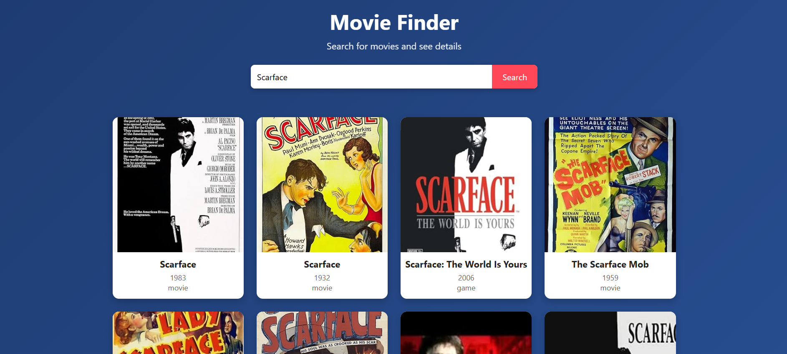
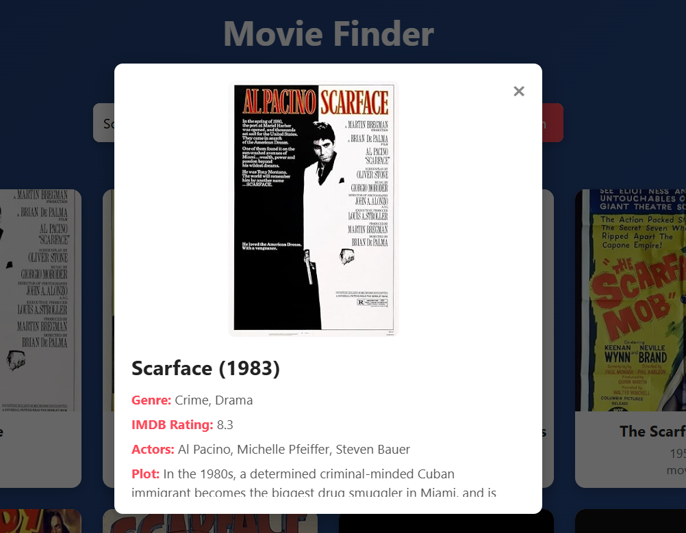

# 🎬 Movie Finder App

A simple, responsive **Movie Finder application** built with **HTML, CSS, and JavaScript**.  
This project allows users to search movies via the **OMDb API**, view results in a clean card layout, and open detailed movie info in a modal.

---

## 🚀 Features
- 🔎 Search movies by title  
- 🎥 Display movie posters, year, and type  
- 📖 View detailed info (genre, rating, actors, plot) in a modal  
- ⏳ Loading spinner for better UX  
- 📱 Fully responsive layout for mobile and desktop  

---

## 🎨 Demo
👉 **Live Demo:** [Click here](https://montesinodev.github.io/movie-finder-app/)  
👉 **Source Code:** [GitHub Repo](https://github.com/montesinodev/movie-finder-app)

---

## 🛠️ Technologies Used
- **HTML5**  
- **CSS3** (Flexbox, Grid, responsive modal design)  
- **JavaScript (ES6)**  
- **OMDb API** for movie data  

---

## 📸 Screenshots
### Search Results


### Movie Details Modal


---

## 📂 How to Run Locally
1. Clone this repository:  
   ```bash
   git clone https://github.com/montesinodev/movie-finder-app.git

2. Open the folder and double-click index.html in your browser.

## 👨‍💻 Author

**Marlon Montesino** - **Frontend Developer | Passionate about building clean and interactive web applications**  
**🔗** [Portfolio](https://montesinodev.github.io/my-portfolio)
 **|** [LinkedIn](https://www.linkedin.com/in/marlon-m-324a70147)